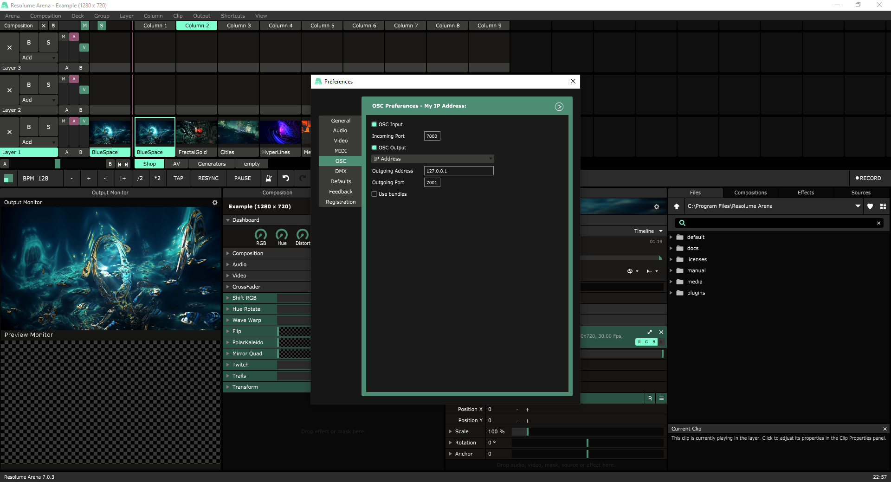
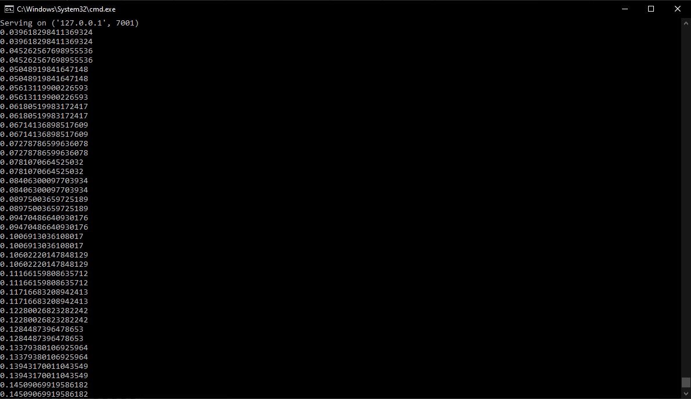

# Resolume OSC server
A simple Open Sound Control (OSC) server that works with Resolume.

## Setup
Note: If you're using Linux Bash for Windows, [see this guide](https://www.howtogeek.com/261575/how-to-run-graphical-linux-desktop-applications-from-windows-10s-bash-shell/).

To clone and run this repository you'll need [Git](https://git-scm.com) and [Python](https://www.python.org/downloads/). From your command line:

```bash
# Clone this repository
git clone https://github.com/xSpylon/resolume-osc-server.git
# Go into the repository
cd resolume-osc-server
# Install python-osc
pip install python-osc
```

## Resolume configuration (optional)
_This step is optional and meant for those intending to use this OSC server with Resolume._

To configure your Resolume environment, open **'Preferences' > 'OSC'**. 
Check the checkbox of the option **'OSC Output'**, and select **'IP Address'** from the dropdown menu. 
Next up, change the **'Outgoing Address'** and the **'Outgoing Port'** to fit your situation. The default values will work fine for a local environment.


## Usage
Once you have succesfully finished the setup, you can run the server. If you are intending to use this OSC server with Resolume, open up Resolume first. Afterwards, from your command line:

```bash
# Run the server
python server.py
```


## Resources
- [python-osc.readthedocs.io](https://python-osc.readthedocs.io) - all of the documentation about Python-osc




